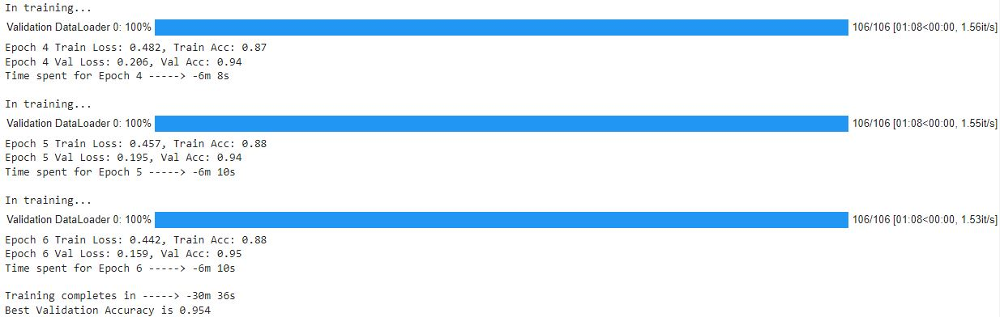
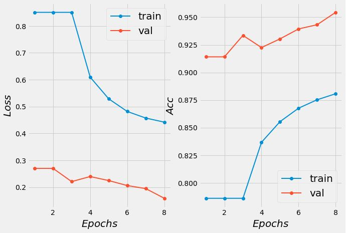
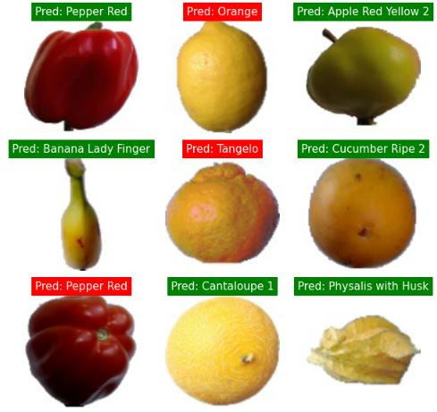
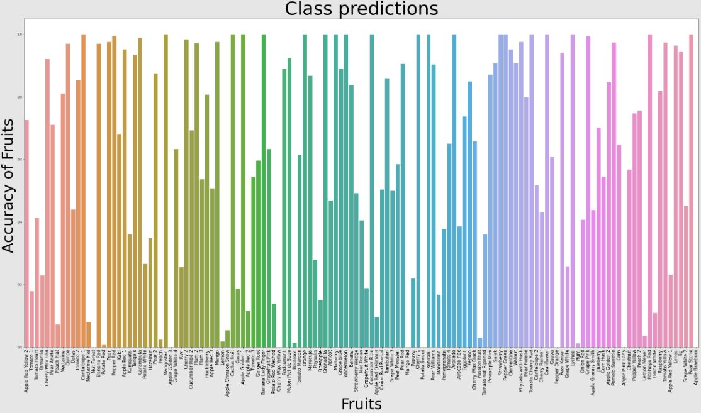
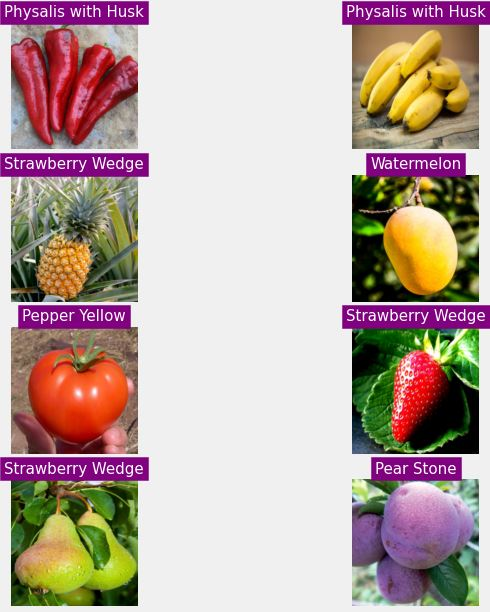
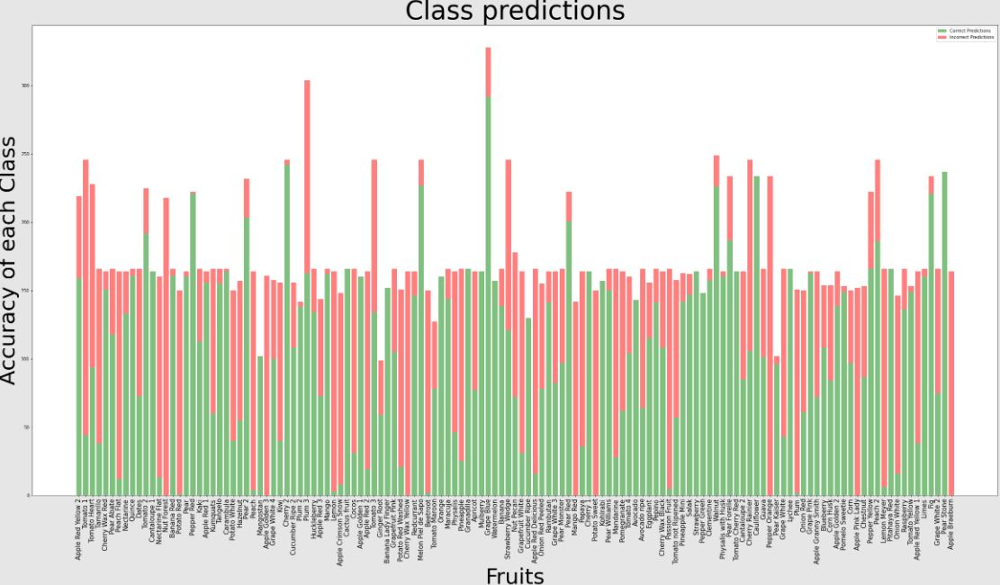

# FruitsClassifier with Pytorch Lightning 🍉

  

### _On this project, I convert my FruitsClassifier from Pytorch to Pytorch Lightning. I employ a callback module, a checkpoint mode to store and save the model state_dict. I conduct resume training, plot loss and accuracy from previous trains. I check the accuracy for each class and make predictions on images from outside the dataset._

&nbsp;

## **✍️ Documentation:**

### - **[Convert my Pytorch model to Pytorch Lightning]**

### - **[FruitsClassifier on Fruits 360]**

### - **Full Training on Kaggle | GoogleNet | 94% Acc**

&nbsp;

## **💥 Training Epochs**

&nbsp;

## **🍇 Visualize Loss and Accuracy**

&nbsp;

## **🍌 Visualize model performance on test dataset**

&nbsp;

## **🍎 Accuracy of each class**

&nbsp;

## **🍍 Image Predictions from outside the Dataset**

&nbsp;

## **🍑 Accuracy of each class: green(correct predictions), red(incorrect predictions)**

[Convert my Pytorch model to Pytorch Lightning]: https://wordpress.com/post/blogbybao.wordpress.com/1261
[FruitsClassifier on Fruits 360]: https://qbaocaca.github.io/fruits_classifier/
